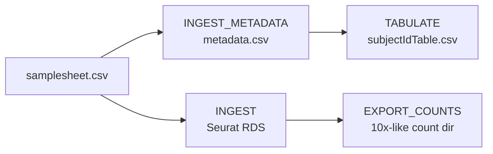
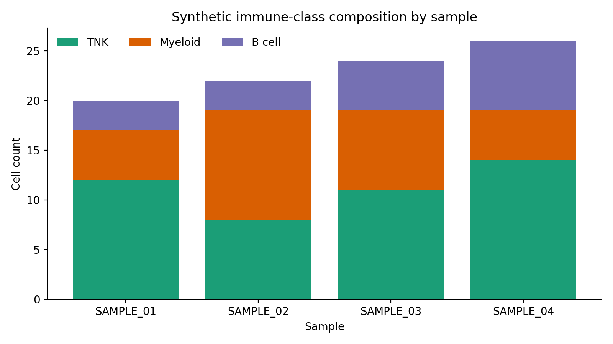

# Synthetic Tabulation Walkthrough

This vignette uses only the seeded fixture bundle under `tests/fixtures/synthetic_trial_data/`. It is safe to publish, safe to run in CI, and representative of the file shapes emitted by `ingest_tabulate` and `ingest_export`.

---

## Workflow map



---

## Fixture bundle

- `sample_metadata.csv`: seeded cell-level metadata used to emulate the metadata-only ingest path.
- `subjectTable_TB.csv`: seeded subject-level summary table used to emulate the tabulation output.
- `sample_counts/`: seeded 10x-like export containing `matrix.mtx`, `features.tsv`, `barcodes.tsv`, and `obs_meta.csv`.

The companion R Markdown notebook is `example_tabulation_script.rmd` in the repository root.

---

## Example metadata output

The first synthetic plot shows the broad immune-class mix per sample after metadata ingest.



Representative `subjectTable_TB.csv` rows:

```csv
cDNA_ID,SubjectId,Group,Timepoint,Tissue,TNK_Fraction,Myeloid_Fraction,Activated_TCell_Fraction,Neutrophil_Fraction
SAMPLE_01,SUBJ_01,BCG,Day 7,Lung-R,0.60,0.25,0.29,0.05
SAMPLE_02,SUBJ_02,BCG,Day 28,Lung-L,0.36,0.50,0.29,0.27
SAMPLE_03,SUBJ_03,RhCMV,Day 7,BAL,0.46,0.33,0.24,0.21
SAMPLE_04,SUBJ_04,Control,Mock,Lung-R,0.54,0.19,0.35,0.12
```

---

## Example tabulation output

The tabulation step pivots those metadata proportions into a subject-level matrix.


This is the format downstream notebooks should expect from `outputs/tabulate/subjectIdTable.csv`.

---

## Example count export

The export workflow produces a 10x-like directory that can be read by Seurat, Scanpy, or BPCells.


That directory contains:

- `matrix.mtx`
- `features.tsv`
- `barcodes.tsv`
- `obs_meta.csv`

---

## Rebuild locally

Regenerate the seeded bundle and refresh the docs assets with:

```bash
Rscript tests/fixtures/simulate_trial_data.R \
  --output-dir tests/fixtures/synthetic_trial_data \
  --target all \
  --seed 20260414

uvx --with matplotlib python scripts/docs/generate_example_plots.py
bash scripts/docs/generate_api_docs.sh
mkdocs build --strict
```

The generated API pages are available under [API Reference](../api/index.md).