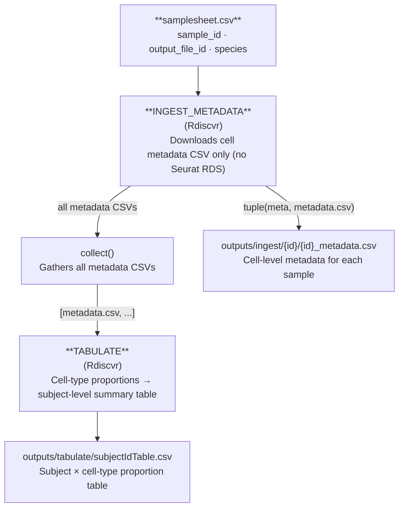
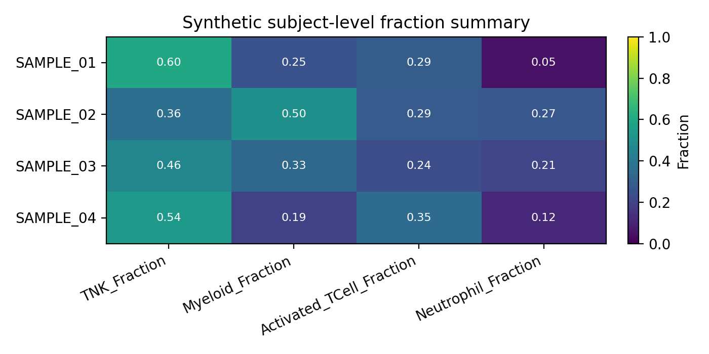

# Ingest + Tabulate

`--workflow ingest_tabulate`

Downloads cell-level metadata (without full Seurat objects) from LabKey and aggregates it into a subject-level summary table. No GPU, no HPC required — the lightest workflow and the best starting point for cohort QC and metadata exploration.

---

## Stage-by-stage dataflow



---

## Inputs

### Samplesheet

Path: `--input` (default `data/samplesheet.csv`)

See [Data Formats → Samplesheet](../data-formats.md#samplesheet).

### Required parameters

| Parameter | Description |
|---|---|
| `--labkey_base_url` | LabKey server base URL |
| `--labkey_folder` | LabKey folder path |

### Optional parameters

| Parameter | Default | Description |
|---|---|---|
| `--tabulate_id_cols` | `cDNA_ID,SubjectId,Vaccine,Timepoint,Tissue` | Subject-level ID columns to carry into the summary table |
| `--tabulate_celltype_cols` | _(empty)_ | Additional cell-type columns beyond the standard RIRA set |
| `--tabulate_parent_col` | _(empty)_ | Parent lineage gating column (defaults to `RIRA_Immune.cellclass`) |
| `--tabulate_celltype_parent_map` | _(empty)_ | Override parent→child hierarchy (e.g. `RIRA_TNK_v2.cellclass:TNK`) |
| `--outdir` | `outputs/` | Output directory |

---

## Outputs

### INGEST_METADATA → `outputs/ingest/{sample_id}/`

| File | Description |
|---|---|
| `{sample_id}_metadata.csv` | Cell-level metadata table for the sample. Each row is one cell (barcode). Columns include `barcode`, `sample_id`, `species`, and all RIRA/custom annotation columns present in the Seurat object on LabKey. |

!!! tip "Column name normalization"
    The module automatically normalizes column name aliases:
    `cellbarcode` → `barcode`, `RIRA_Immune_v2.cellclass` → `RIRA_Immune.cellclass`.

### TABULATE → `outputs/tabulate/subjectIdTable.csv`

Columns depend on `--tabulate_id_cols` and available RIRA cell-type columns. Structure:

| Column group | Description |
|---|---|
| `--tabulate_id_cols` | Subject identity columns carried from metadata (e.g. `cDNA_ID`, `SubjectId`, `Vaccine`, `Timepoint`, `Tissue`) |
| `{celltype_col}__{value}` | One column per cell-type category, containing the proportion (0–1) of cells in that category per subject |

The standard RIRA columns automatically included when present:

- `RIRA_Immune.cellclass` (broad lineage: T cell, B cell, Myeloid, …)
- `RIRA_TNK_v2.cellclass` (T/NK subtypes, conditioned on immune parent)
- `RIRA_Myeloid_v3.cellclass` (myeloid subtypes)

---

## Synthetic example subject table

The docs and smoke tests use seeded metadata to generate a safe `subjectTable_TB.csv` example. The heatmap below shows the type of wide-format subject summary emitted by `TABULATE`.



Each row is one subject/sample identity record and each numeric column is a proportion derived from the cell-level metadata.

See the full [Synthetic Tabulation Walkthrough](../vignettes/synthetic-tabulation.md) and the generated [API Reference → Workflows](../api/workflows.md#ingest-tabulate-pipeline).

---

## Running locally

```bash
nextflow run main.nf \
  --workflow ingest_tabulate \
  --labkey_base_url https://labkey.example.org \
  --labkey_folder /My/Project/Folder
```

With custom identity and cell-type columns:
```bash
nextflow run main.nf \
  --workflow ingest_tabulate \
  --tabulate_id_cols "cDNA_ID,SubjectId,Vaccine,Timepoint,Tissue" \
  --tabulate_celltype_cols "RIRA_TNK_v2.cellclass" \
  --tabulate_parent_col "RIRA_Immune.cellclass" \
  --labkey_base_url https://labkey.example.org \
  --labkey_folder /My/Project/Folder
```

---

## Running on HPC

```bash
sbatch slurm_nextflow.sh \
  --workflow ingest_tabulate \
  --labkey_base_url https://labkey.example.org \
  --labkey_folder /My/Project/Folder
```

---

## Resource profile

| Step | CPUs | Memory | Wall time |
|---|---|---|---|
| INGEST_METADATA | 4 | 32 GB | 4 h |
| TABULATE | 4 | 24 GB | 4 h |

---

## Downstream use

The `subjectIdTable.csv` is designed for direct import into R or Python for cohort-level analysis:

```r
# R
tbl <- read.csv("outputs/tabulate/subjectIdTable.csv")
```

```python
# Python
import pandas as pd
tbl = pd.read_csv("outputs/tabulate/subjectIdTable.csv")
```

See also `example_tabulation_script.rmd` in the repository root for a worked example.
