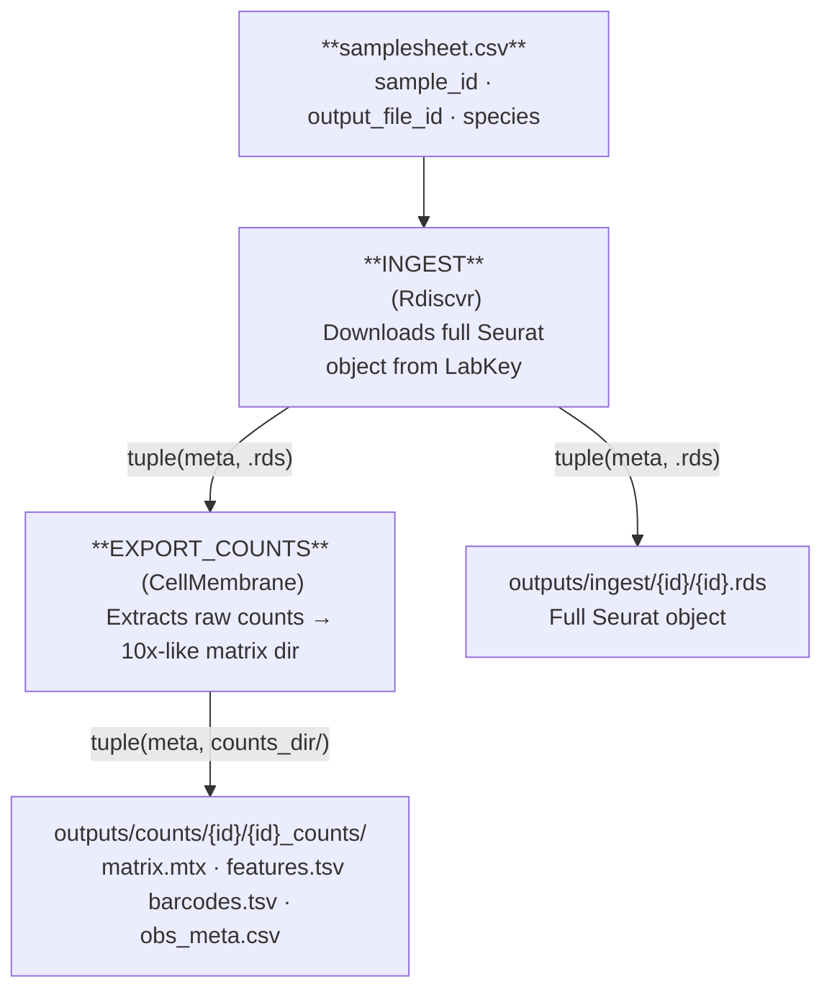

# Ingest + Export

`--workflow ingest_export`

Downloads full Seurat objects from LabKey for each sample and immediately exports the raw RNA count matrix as a 10x-like directory. No GPU, no HPC required — runs on a local Mac or any Linux host.

---

## Stage-by-stage dataflow



---

## Inputs

### Samplesheet

Path: `--input` (default `data/samplesheet.csv`)

See [Data Formats → Samplesheet](../data-formats.md#samplesheet).

### Required parameters

| Parameter | Description |
|---|---|
| `--labkey_base_url` | LabKey server base URL |
| `--labkey_folder` | LabKey folder path |

### Optional parameters

| Parameter | Default | Description |
|---|---|---|
| `--export_assay` | `RNA` | Seurat assay to export as count matrix |
| `--outdir` | `outputs/` | Output directory |

---

## Outputs

### INGEST → `outputs/ingest/{sample_id}/`

| File | Description |
|---|---|
| `{sample_id}.rds` | Full Seurat object (counts + all metadata) downloaded from LabKey. Contains at minimum the cells passing QC and their RNA assay. |

### EXPORT_COUNTS → `outputs/counts/{sample_id}/{sample_id}_counts/`

A 10x-like matrix directory compatible with e.g. `Seurat::Read10X()`, `scanpy.read_10x_mtx()`, or `BPCells::open_matrix_dir()`:

| File | Description |
|---|---|
| `matrix.mtx` | Sparse raw count matrix in Market Exchange (MatrixMarket) format. Rows = genes, columns = cells. |
| `features.tsv` | Gene names, one per row, matching row order in `matrix.mtx`. |
| `barcodes.tsv` | Cell barcodes, one per row, matching column order in `matrix.mtx`. |
| `obs_meta.csv` | Cell-level metadata from `seurat_object[[]]` with additional columns `sample_id`, `species`, `output_file_id`, and `barcode`. |

---

## Synthetic example export

The docs and CI use a seeded fixture bundle in `tests/fixtures/synthetic_trial_data/` so the exported count layout is visible without any live Prime-seq download.


This is the same file shape produced by `EXPORT_COUNTS`: `matrix.mtx`, `features.tsv`, `barcodes.tsv`, and `obs_meta.csv` in a per-sample directory.

For the generated code-level reference, see [API Reference → Workflows](../api/workflows.md#ingest-export-pipeline).

---

## Running locally

```bash
nextflow run main.nf \
  --workflow ingest_export \
  --labkey_base_url https://labkey.example.org \
  --labkey_folder /My/Project/Folder
```

On macOS (or Linux without SLURM) the local executor is auto-selected; no `-profile` flag is required.

To limit output location:
```bash
nextflow run main.nf \
  --workflow ingest_export \
  --outdir ./outputs/dev \
  --labkey_base_url https://labkey.example.org \
  --labkey_folder /My/Project/Folder
```

---

## Running on HPC

For routine SLURM runs, the recommended entrypoint is a copied `runs/<name>/run.sh` template. The command below shows the repo-root launcher alternative.

```bash
bash slurm_nextflow.sh \
  --workflow ingest_export \
  --labkey_base_url https://labkey.example.org \
  --labkey_folder /My/Project/Folder
```

---

## Resource profile

| Step | CPUs | Memory | Wall time |
|---|---|---|---|
| INGEST | 4 | 32 GB | 4 h |
| EXPORT_COUNTS | 4 | 32 GB | 4 h |
