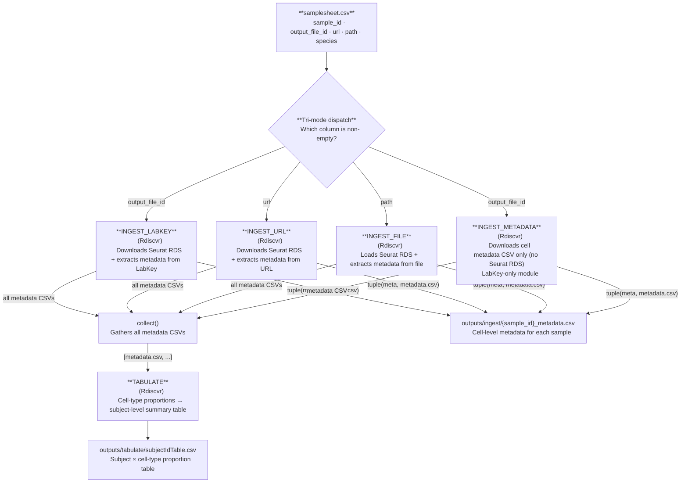

# Ingest + Tabulate

`--workflow ingest_tabulate`

Downloads or extracts cell-level metadata from LabKey, a URL, or a local filepath for each sample, and aggregates it into a subject-level summary table. No GPU, no HPC required — the lightest workflow and the best starting point for cohort QC and metadata exploration.

---

## Stage-by-stage dataflow



!!! info "Two parallel ingest paths"
    When a row uses `output_file_id`, the workflow fires **both** `INGEST_LABKEY` and `INGEST_METADATA` for that sample. `INGEST_METADATA` downloads cell-level metadata only (no full Seurat RDS), while `INGEST_LABKEY` downloads the full RDS and extracts metadata from it — redundant for tabulate alone, but this allows the same workflow to feed a future export or integration step without a separate download. For `url` and `path` rows, only the corresponding ingest module runs, since `INGEST_METADATA` is LabKey-specific.

---

## Inputs

### Samplesheet

Path: `--input` (default `data/samplesheet.csv`)

Each row must have exactly one of `output_file_id`, `url`, or `path` populated. See [Data Formats → Samplesheet](../data-formats.md#samplesheet) for the full column specification.

```csv
sample_id,output_file_id,url,path,species
SAMPLE_LABKEY,12345,,,human
SAMPLE_URL,,https://example.org/data.rds,,macaque
SAMPLE_FILE,,,/home/user/data/mydata.h5ad,mouse
```

### Required parameters (LabKey mode)

| Parameter | Description |
|---|---|
| `--labkey_base_url` | LabKey server base URL |
| `--labkey_folder` | LabKey folder path |

These parameters are **only required** for rows that use `output_file_id` (LabKey mode). Rows using `url` or `path` do not need LabKey credentials.

### Optional parameters

| Parameter | Default | Description |
|---|---|---|
| `--tabulate_id_cols` | `cDNA_ID,SubjectId,Vaccine,Timepoint,Tissue` | Subject-level ID columns to carry into the summary table |
| `--tabulate_celltype_cols` | _(empty)_ | Additional cell-type columns beyond the standard RIRA set |
| `--tabulate_parent_col` | _(empty)_ | Parent lineage gating column (defaults to `RIRA_Immune.cellclass`) |
| `--tabulate_celltype_parent_map` | _(empty)_ | Override parent→child hierarchy (e.g. `RIRA_TNK_v2.cellclass:TNK`) |
| `--outdir` | `outputs/` | Output directory |

---

## Outputs

### INGEST_* → `outputs/ingest/{sample_id}_metadata.csv`

| File | Description |
|---|---|
| `{sample_id}_metadata.csv` | Cell-level metadata table for the sample. Each row is one cell (barcode). Columns include `barcode`, `sample_id`, `species`, and all RIRA/custom annotation columns present in the source object. |

Produced by all four ingest modules. `INGEST_METADATA` downloads the metadata CSV directly from LabKey without pulling the full Seurat RDS. `INGEST_LABKEY`, `INGEST_URL`, and `INGEST_FILE` extract the same metadata from the full Seurat object.

!!! tip "Column name normalization"
    All ingest modules automatically normalize column name aliases:
    `cellbarcode` → `barcode`, `RIRA_Immune_v2.cellclass` → `RIRA_Immune.cellclass`.

### TABULATE → `outputs/tabulate/subjectIdTable.csv`

Columns depend on `--tabulate_id_cols` and available RIRA cell-type columns. Structure:

| Column group | Description |
|---|---|
| `--tabulate_id_cols` | Subject identity columns carried from metadata (e.g. `cDNA_ID`, `SubjectId`, `Vaccine`, `Timepoint`, `Tissue`) |
| `{celltype_col}__{value}` | One column per cell-type category, containing the proportion (0–1) of cells in that category per subject |

The standard RIRA columns automatically included when present:

- `RIRA_Immune.cellclass` (broad lineage: T cell, B cell, Myeloid, …)
- `RIRA_TNK_v2.cellclass` (T/NK subtypes, conditioned on immune parent)
- `RIRA_Myeloid_v3.cellclass` (myeloid subtypes)

---

## Synthetic example subject table

The docs and smoke tests use seeded metadata to generate a safe `subjectTable_TB.csv` example. The heatmap below shows the type of wide-format subject summary emitted by `TABULATE`.


Each row is one subject/sample identity record and each numeric column is a proportion derived from the cell-level metadata.

See the full [Synthetic Tabulation Walkthrough](../vignettes/synthetic-tabulation.md) and the generated [API Reference → Workflows](../api/workflows.md#ingest-tabulate-pipeline).

---

## Running locally

### LabKey mode

```bash
nextflow run main.nf \
  --workflow ingest_tabulate \
  --labkey_base_url https://labkey.example.org \
  --labkey_folder /My/Project/Folder
```

### URL mode (no LabKey required)

```bash
nextflow run main.nf \
  --workflow ingest_tabulate \
  --input data/samplesheet_url.csv
```

### Local file mode (no LabKey required)

```bash
nextflow run main.nf \
  --workflow ingest_tabulate \
  --input data/samplesheet_file.csv
```

With custom identity and cell-type columns:
```bash
nextflow run main.nf \
  --workflow ingest_tabulate \
  --tabulate_id_cols "cDNA_ID,SubjectId,Vaccine,Timepoint,Tissue" \
  --tabulate_celltype_cols "RIRA_TNK_v2.cellclass" \
  --tabulate_parent_col "RIRA_Immune.cellclass" \
  --labkey_base_url https://labkey.example.org \
  --labkey_folder /My/Project/Folder
```

---

## Running on HPC

For routine SLURM runs, the recommended entrypoint is a copied `runs/<name>/run.sh` template. The command below shows the repo-root launcher alternative.

```bash
bash slurm_nextflow.sh \
  --workflow ingest_tabulate \
  --labkey_base_url https://labkey.example.org \
  --labkey_folder /My/Project/Folder
```

> **Container prerequisites:** When running on SLURM, Apptainer must be configured before your first run. See [Container image pre-pull and SIF cache](../usage.md#6-container-image-pre-pull-and-sif-cache) in the usage guide for graphroot setup, storage details, and all `NXF_APPTAINER_*` environment variables.

---

## Resource profile

| Step | CPUs | Memory | Wall time |
|---|---|---|---|
| INGEST_LABKEY / INGEST_URL / INGEST_FILE | 4 | 32 GB | 4 h |
| INGEST_METADATA | 4 | 32 GB | 4 h |
| TABULATE | 4 | 24 GB | 4 h |

---

## Downstream use

The `subjectIdTable.csv` is designed for direct import into R or Python for cohort-level analysis:

```r
# R
tbl <- read.csv("outputs/tabulate/subjectIdTable.csv")
```

```python
# Python
import pandas as pd
tbl = pd.read_csv("outputs/tabulate/subjectIdTable.csv")
```

See also `example_tabulation_script.rmd` in the repository root for a worked example.