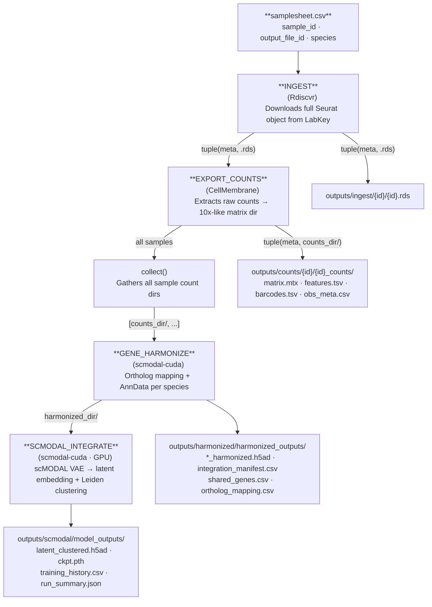

# Integration Pipeline

`--workflow integration`

The integration pipeline downloads Seurat objects from LabKey, exports per-sample count matrices, harmonizes genes across species, and trains a scMODAL variational autoencoder to produce a joint multi-species latent embedding with Leiden clustering.

!!! warning "GPU required"
    This workflow must run on an HPC cluster via `-profile slurm`. It requires at least one NVIDIA GPU for the `SCMODAL_INTEGRATE` step. It **cannot run** on a local Mac or CPU-only Linux host.
  The only CPU path is the GitHub Actions smoke-test stub, enabled with `--scmodal_use_cpu true` together with `-stub-run`.

---

## Stage-by-stage dataflow



---

## Inputs

### Samplesheet

Path: `--input` (default `data/samplesheet.csv`)

See [Data Formats → Samplesheet](../data-formats.md#samplesheet) for the schema. All three columns are required for the full pipeline.

### Required parameters

| Parameter | Description |
|---|---|
| `--labkey_base_url` | LabKey server base URL |
| `--labkey_folder` | LabKey folder path |
| `--species_order` | Comma-separated species list (default `human,macaque,mouse`) |

---

## Outputs at each stage

### INGEST → `outputs/ingest/{sample_id}/`

| File | Description |
|---|---|
| `{sample_id}.rds` | Full Seurat object (counts + metadata) downloaded from LabKey |

### EXPORT_COUNTS → `outputs/counts/{sample_id}/{sample_id}_counts/`

A 10x-like matrix directory (one per sample):

| File | Description |
|---|---|
| `matrix.mtx` | Sparse count matrix (genes × cells, Market Exchange format) |
| `features.tsv` | Gene / feature names, one per row |
| `barcodes.tsv` | Cell barcode identifiers, one per row |
| `obs_meta.csv` | Cell-level metadata exported from the Seurat object |

### GENE_HARMONIZE → `outputs/harmonized/harmonized_outputs/`

| File | Description |
|---|---|
| `{idx}_{species}_harmonized.h5ad` | One AnnData per species. Cells × shared ortholog genes, log-normalised. |
| `integration_manifest.csv` | Maps each species file to its integration order index. |
| `shared_genes.csv` | Shared ortholog gene list used across all species. |
| `ortholog_mapping.csv` | Full HomoloGene-based ortholog mapping table (all species). |
| `n_shared.txt` | Count of shared genes (read by SCMODAL_INTEGRATE). |

### SCMODAL_INTEGRATE → `outputs/scmodal/model_outputs/`

| File | Description |
|---|---|
| `latent_clustered.h5ad` | Concatenated AnnData with `obsm["X_scmodal"]` latent coords, UMAP, and Leiden cluster labels. |
| `ckpt.pth` | Trained scMODAL model checkpoint (PyTorch). |
| `training_history.csv` | Per-run summary: n_cells, n_genes, n_latent, training time, device. |
| `run_summary.json` | JSON summary of integration parameters and results. |
| `gpu_info.txt` | Output of `nvidia-smi` captured during the run. |

---

## Synthetic input snapshot

The seeded metadata fixture used by docs and CI gives a safe preview of the cell-level composition that flows into harmonization and scMODAL integration.


This plot is derived from the synthetic `sample_metadata.csv` bundle and is useful for validating that broad immune-class distributions look sensible before the GPU stage.

For the generated code-level reference, see [API Reference → Workflows](../api/workflows.md#integration-pipeline).

---

## Running on HPC

For routine SLURM runs, the recommended entrypoint is a copied `runs/<name>/run.sh` template. The commands below show the repo-root launcher alternative, which is also the easiest way to get a separate pre-pull job ahead of the orchestrator.

```bash
# Sync the repo (recommended before each run)
sbatch slurm_sync_repo.sh

# Submit the integration pipeline from a login node so pre-pull runs as its own job first
bash slurm_nextflow.sh \
  --workflow integration \
  --labkey_base_url https://labkey.example.org \
  --labkey_folder /My/Project/Folder
```

Optionally, sync and launch in one step:
```bash
SYNC_REPO_BEFORE_RUN=true bash slurm_nextflow.sh \
  --workflow integration \
  --labkey_base_url https://labkey.example.org \
  --labkey_folder /My/Project/Folder
```

> **Container prerequisites:** When running on SLURM, Apptainer must be configured before your first run. See [Container image pre-pull and SIF cache](../usage.md#6-container-image-pre-pull-and-sif-cache) in the usage guide for graphroot setup, storage details, and all `NXF_APPTAINER_*` environment variables.

---

## Resource profile (SLURM)

| Step | CPUs | Memory | Wall time | GPU |
|---|---|---|---|---|
| INGEST | 4 | 32 GB | 4 h | — |
| EXPORT_COUNTS | 4 | 32 GB | 4 h | — |
| GENE_HARMONIZE | 4 | 32 GB | 8 h | — |
| SCMODAL_INTEGRATE | 8 | 64 GB | 24 h | 1× (`--gres=gpu:1 --qos=gpu`) |

---

## Key parameters

| Parameter | Default | Description |
|---|---|---|
| `--scmodal_latent` | `20` | Latent embedding dimensions |
| `--scmodal_training_steps` | `10000` | VAE training steps |
| `--scmodal_batch_size` | `500` | Mini-batch size |
| `--scmodal_neighbors` | `30` | KNN graph neighbours |
| `--leiden_resolution` | `0.5` | Leiden clustering resolution |

See the full [Parameter reference](../parameters.md) for all options.
